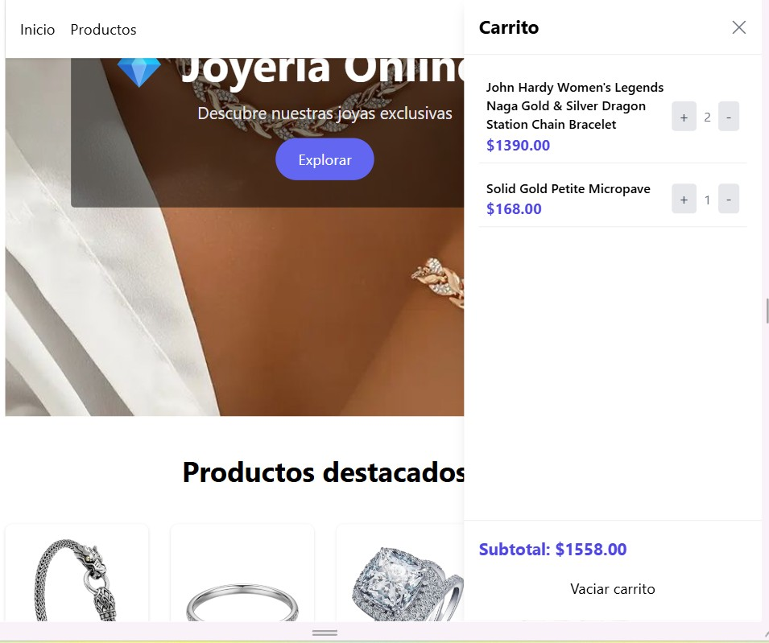

💎 Joyería Online LS

Proyecto de carrito de compras desarrollado con JavaScript Vanilla, que consume datos desde una API externa y utiliza LocalStorage para persistir el estado del carrito.
Diseño responsive usando Tailwind CSS y carrito tipo off-canvas.

🛍️ Funcionalidades

✅ Consumo de API externa para mostrar productos

✅ Listado dinámico de productos

✅ Agregar productos al carrito

✅ Incrementar y disminuir cantidades

✅ Eliminar productos

✅ Vaciar carrito

✅ Cálculo automático del subtotal

✅ Persistencia del carrito usando LocalStorage

✅ Contador de productos en el carrito

✅ Carrito lateral (off-canvas)

🔗 API utilizada

Los productos se obtienen desde Fake Store API:

https://fakestoreapi.com/products/category/jewelery

👩🏽‍💻 Tecnologías utilizadas

HTML5

CSS3

Tailwind CSS

JavaScript 

Fetch API

LocalStorage

⚙️ Lógica principal del carrito

El carrito se almacena en un array carrito

Los datos se guardan en localStorage para no perder el estado al recargar

Se usan funciones para:

agregarAlCarrito()

eliminarProducto()

sumarUnidad()

mostrarCarrito()

mostrarTotal()

actualizarContador()

▶️ Cómo ejecutar el proyecto

Clona el repositorio:

git clone https://github.com/Lilisp16/carrito-api-js.git

Abre el archivo index.html en tu navegador
(no requiere servidor)

📌 Mejoras futuras

🔐 Autenticación de usuarios

💳 Integración con pasarela de pagos

📦 Más categorías de productos

🧪 Tests

👩‍💻 By

Lili
Proyecto realizado para portafolio personal 💼✨